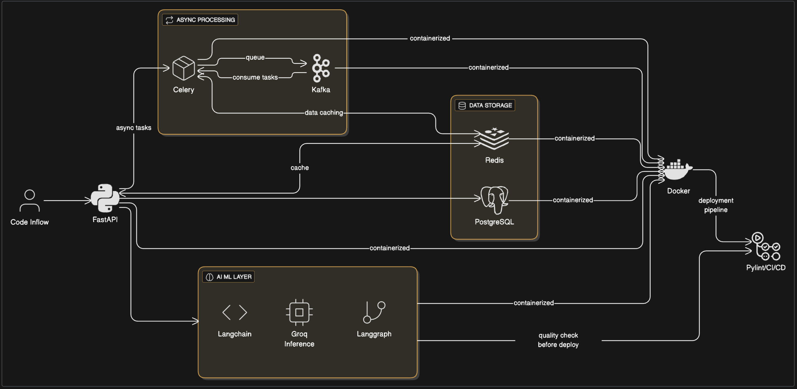

# Autovate - Agentic Flow

An intelligent codebase analysis and commit review system that leverages LLM-powered agents to understand, analyze, and provide insights on code repositories and their changes.



## 🎯 Project Overview

Agentic Flow is an automated code analysis framework that combines static code analysis with LLM-powered intelligence to provide comprehensive insights into codebases and their evolution. The system consists of two main components:

1. **Langraph Module**: Scans and analyzes entire codebases to generate structural summaries
2. **Git Module**: Analyzes git commits and generates context-aware prompts for understanding code changes

## ✨ Features

### 📊 Codebase Analysis (Langraph)
- **Multi-language Support**: Automatically detects and analyzes Python, JavaScript, TypeScript, Java, Go, Rust, C/C++, and more
- **Project Type Detection**: Identifies project frameworks and configurations (Python packages, Node.js apps, Docker containers, etc.)
- **AST-based Parsing**: Deep structural analysis using Abstract Syntax Trees for Python code
- **LLM Integration**: Optional Groq API integration for AI-powered project insights
- **Scalable**: Handles large codebases efficiently (up to 2000 files by default)

### 🔍 Git Commit Analysis
- **Change Detection**: Parses git diffs and identifies exact code changes
- **Context Extraction**: Provides surrounding code context for each change
- **Smart Navigation**: Identifies enclosing functions/classes for each modification
- **RAG Prompt Generation**: Creates structured prompts for retrieval-augmented generation
- **Multi-commit Support**: Analyzes changes across commit history

## 🏗️ Architecture

The system follows an agentic workflow pattern where:

1. **Code Scanner Agent**: Traverses the repository and collects file metadata
2. **Parser Agent**: Analyzes code structure and extracts declarations
3. **Analyzer Agent**: Aggregates information and generates insights
4. **LLM Agent** (optional): Provides intelligent summaries and recommendations
5. **Git Agent**: Monitors commits and generates context-aware change reports

Refer to the flow diagram above for a visual representation of the system architecture.

## 🚀 Getting Started

### Prerequisites

- Python 3.11+
- Git (for git module functionality)
- Optional: Groq API key (for LLM-powered analysis)

### Run the local MVP (API + Worker + Redis)

```bash
docker compose up --build
```

When running, the API is available at `http://localhost:8000`.

Open the dashboard at `http://localhost:8000/` to:
- Launch jobs (Docs, Tests, Self-Heal, Staging)
- View recent jobs and their live status

Example calls:

```bash
# Health
curl http://localhost:8000/health

# Generate docs
curl -X POST http://localhost:8000/jobs/doc \
  -H 'Content-Type: application/json' \
  -d '{"repo_path":"/workspace"}'

# Generate and run tests
curl -X POST http://localhost:8000/jobs/tests/generate-run \
  -H 'Content-Type: application/json' \
  -d '{"repo_path":"/workspace"}'

# Self heal (format-only)
curl -X POST http://localhost:8000/jobs/self-heal \
  -H 'Content-Type: application/json' \
  -d '{"repo_path":"/workspace","format_only":true}'

# Staging validation (compose)
curl -X POST http://localhost:8000/jobs/stage/validate \
  -H 'Content-Type: application/json' \
  -d '{"repo_path":"/workspace"}'

# Poll job status
curl http://localhost:8000/jobs/<JOB_ID>
```

### Installation

1. Clone the repository:
```bash
git clone https://github.com/yourusername/agentic_flow.git
cd agentic_flow
```

2. Install required dependencies:
```bash
pip install -r requirements.txt
```

Required packages:
- `GitPython` - For git operations
- `requests` - For API calls (optional, for LLM features)

### Quick Start

#### Analyze a Codebase

Basic scan without LLM:
```bash
python langraph.py /path/to/your/project
```

With LLM analysis (requires Groq API key):
```bash
python langraph.py /path/to/your/project --llm --key YOUR_GROQ_API_KEY
```

Or set the API key as an environment variable:
```bash
export GROQ_API_KEY=your_api_key_here
python langraph.py /path/to/your/project --llm
```

#### Analyze Git Commits

```bash
python git_module.py
```

This will analyze the most recent commit in the `demo-repo` directory and generate a comprehensive RAG prompt.

## 📖 Usage Examples

### Example 1: Scanning a Python Project

```bash
python langraph.py ~/projects/my-python-app --llm
```

**Output:**
```json
{
  "root": "/Users/user/projects/my-python-app",
  "file_count": 42,
  "languages": {
    "python": 35,
    "json": 5,
    "yaml": 2
  },
  "project_guesses": ["python-package", "dockerized"],
  "llm_status": "ok"
}
```

### Example 2: Analyzing a Git Commit

The git module automatically generates a structured analysis including:
- All changed files
- Type of changes (additions/deletions)
- Code context around changes
- Enclosing function/class information
- Aggregated RAG prompt for LLM analysis

## 🔧 Technical Details

### Langraph Module

**Core Functions:**
- `scan_codebase(root_path)`: Recursively scans directory and collects metadata
- `parse_python_structure(source_text)`: Extracts classes and functions using AST
- `infer_project_type(scan_summary)`: Heuristically determines project type
- `analyze_project(path)`: High-level entry point for complete analysis

**Supported Languages:**
- Python, JavaScript, TypeScript, Java, Go, Rust, C/C++, HTML, CSS, YAML, Shell, and more

**Project Markers Detected:**
- Python: `requirements.txt`, `pyproject.toml`, `setup.py`, `Pipfile`
- Node.js: `package.json`, `yarn.lock`
- Docker: `Dockerfile`, `docker-compose.yml`
- Rust: `Cargo.toml`
- Go: `go.mod`

### Git Module

**Core Functions:**
- `parse_patch_for_changes(patch_text)`: Extracts line-by-line changes from diff
- `find_enclosing_python_chain(source_text, lineno)`: AST-based scope detection
- `find_enclosing_by_regex(source_text, lineno)`: Fallback scope detection
- `load_file_at_commit(path, commit_ref)`: Retrieves file content at specific commit

**RAG Context Structure:**
```python
{
    "file_path": "path/to/file.py",
    "ref": "commit_hash",
    "change_type": "add|del",
    "lineno": 42,
    "changed_line": "def new_function():",
    "context": "...surrounding code...",
    "enclosing_chain": "class MyClass -> def my_method",
    "commit": "abc123...",
    "parent_commit": "def456..."
}
```

## 🔮 Future Enhancements

- [ ] Support for more LLM providers (OpenAI, Anthropic, Gemini)
- [ ] Web-based dashboard for visualization
- [ ] Real-time monitoring of repository changes
- [ ] Integration with CI/CD pipelines
- [ ] Code quality scoring and recommendations
- [ ] Multi-repository analysis
- [ ] Custom rules and pattern detection

## 📝 Configuration

### Langraph Settings

- `max_files`: Maximum number of files to scan (default: 2000)
- `max_size`: Maximum file size to process (default: 1MB)
- `ignore_dirs`: Directories to skip (default: `.git`, `__pycache__`, `node_modules`, `.venv`, `venv`)

### Groq API Settings

- `model`: Model to use (default: `groq-1`)
- `endpoint`: API endpoint (default: `https://api.groq.ai/v1`)
- `timeout`: Request timeout in seconds (default: 20)

## 🤝 Contributing

Contributions are welcome! Please feel free to submit pull requests or open issues for bugs and feature requests.

## 📄 License

This project is open source and available under the MIT License.

## 👥 Authors

[](https://github.com/me-sanath)
[](https://github.com/Praveenvin)

## 🙏 Acknowledgments

- Built with Python and leveraging modern AI capabilities
- Inspired by the need for intelligent code review automation
- Powered by Groq's fast LLM inference

## 🧰 Using the Makefile

For local dev and deployment, you can use the included Makefile:

```bash
# Local setup (venv)
make setup

# Run locally
make run-api
make run-worker

# Docker build and compose up
make docker-build                    # builds API and worker images
make docker-up                       # starts API, worker, and redis
make docker-down                     # stops the stack

# Push images (set your registry prefix)
make docker-build VERSION=1.0.0 REGISTRY=ghcr.io/you/
make docker-push  VERSION=1.0.0 REGISTRY=ghcr.io/you/

# Utilities
make fmt
make lint
make test
```

Variables you can override:
- `REGISTRY`: Container registry prefix, e.g., `ghcr.io/you/` or `docker.io/you/`
- `VERSION`: Image tag, e.g., `1.0.0` (defaults to `latest`)
- `PROJECT_NAME`: Base image name (defaults to `autovate`)
- `COMPOSE_FILE`: Compose file path (defaults to `docker-compose.yml`)

---

**Note**: This is a work in progress. The system is designed to be extensible and can be adapted for various code analysis use cases.

